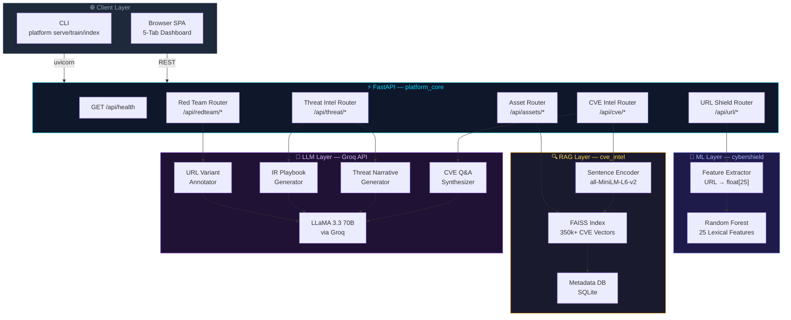
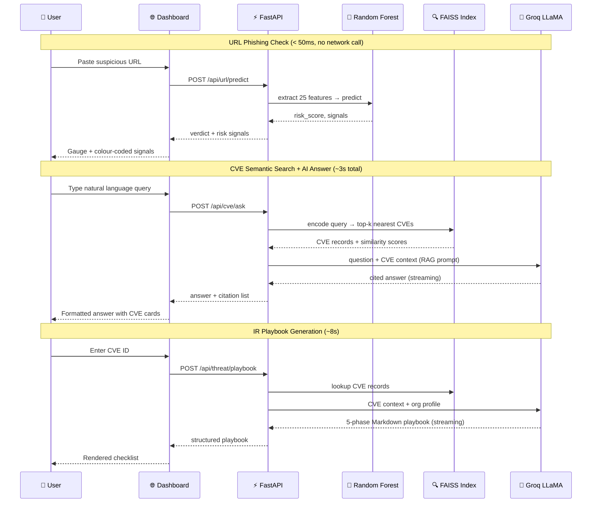

<div align="center">


<br/>

[](https://git.io/typing-svg)

<br/>

[](https://python.org)
[](https://fastapi.tiangolo.com)
[](https://groq.com)
[](https://docker.com)
[](LICENSE)

[](https://scikit-learn.org)
[](https://faiss.ai)
[](https://sbert.net)
[](https://railway.app)
[](https://render.com)

<br/>

> **Unified AI-powered security intelligence platform** combining classical machine learning with large language models.
> Five security features. One dashboard. One API. One deployment.

<br/>

[**🚀 Quick Start**](#-quick-start) · [**🎬 Demo**](#-demo) · [**📖 Docs**](#-api-reference) · [**🐳 Docker**](#-docker) · [**☁️ Deploy**](#-deployment)

</div>

---

## 🎬 Demo

<div align="center">

> Start the server with `platform serve` then open **http://localhost:8000**

</div>

```bash
# Clone and run the interactive demo script
git clone https://github.com/YOUR_USERNAME/cybershield-ai-platform.git
cd cybershield-ai-platform
pip install -e .
platform url train
platform serve &
python Demo/demo.py
```

```
  ──────────────────────────────────────────────────────────────
  PLATFORM HEALTH CHECK
  ──────────────────────────────────────────────────────────────
  ✓ Platform status      ok
  ✓ URL Shield           ready
  ✓ CVE Index            352,841 CVEs loaded
  ✓ LLM                  enabled (Groq · llama-3.3-70b-versatile)

  ──────────────────────────────────────────────────────────────
  1 · URL SHIELD — Phishing Detection
  ──────────────────────────────────────────────────────────────

    http://paypal-secure-login.xyz/verify?token=abc123
    Score: 87/100  ████████░░  LIKELY PHISHING
    ↳ [HIGH]   Suspicious TLD (.xyz)
    ↳ [HIGH]   Social engineering keyword in domain

    https://github.com/login
    Score: 4/100   ░░░░░░░░░░  SAFE
```

> 📁 See [`Demo/sample_outputs.md`](Demo/sample_outputs.md) for full JSON response examples from every feature.

---

## ✨ Features

<div align="center">

| | Feature | What It Does | Inference Time |
|:---:|:---|:---|:---:|
| 🔗 | **URL Shield** | Real-time phishing detection using a Random Forest model trained on 25 lexical URL features | **< 50ms** |
| 🔍 | **CVE Intelligence** | Semantic search over 350,000+ NVD CVEs — ask in plain English, get cited answers | **< 2s** |
| ⚡ | **Threat Narratives** | 4-section AI briefing: Plain English · Attack Surface · Business Impact · Affected Software | **~5s** |
| 📋 | **IR Playbooks** | Complete Incident Response Playbook with Detection → Containment → Eradication → Recovery | **~8s** |
| 📦 | **Asset Correlation** | Match your software inventory against the CVE index, with optional CISO executive summary | **~3s** |
| 🎯 | **Red Team** | Generate adversarial phishing domain variants for authorized penetration testing | **~4s** |

</div>

---

## 🏗️ Architecture



---

## 🔄 Data Flow



---

## 🧰 Tech Stack

<div align="center">

### Core Framework
[](https://python.org)
[](https://fastapi.tiangolo.com)
[](https://docker.com)
[](https://github.com)

</div>

<br/>

<div align="center">

| Layer | Technology | Role |
|:---:|:---|:---|
| 🌐 **Web Framework** | FastAPI 0.115 + Uvicorn | Async REST API, auto-docs, ASGI |
| 🤖 **ML Model** | scikit-learn — Random Forest | Phishing classifier, 25-feature vector |
| 📐 **Feature Engineering** | pandas + numpy | URL → float[25] feature matrix |
| 💾 **Model Storage** | joblib | Serialise / deserialise trained models |
| 🔍 **Vector Search** | FAISS (faiss-cpu) | Approximate nearest-neighbour over 350k CVEs |
| 🧬 **Embeddings** | sentence-transformers | `all-MiniLM-L6-v2` → 384-dim vectors |
| 🧠 **LLM** | Groq · LLaMA 3.3 70B | Explanations, narratives, playbooks, annotations |
| 🔌 **LLM Client** | openai SDK | OpenAI-compatible client (works with Groq + Mistral) |
| ⚙️ **Config** | pydantic-settings | Type-safe env var management, `.env` support |
| 🖥️ **CLI** | Typer + Rich | `platform url train`, `platform cve index`, `platform serve` |
| 🎨 **Frontend** | Vanilla JS + CSS | 5-tab SPA, zero build step, no React/Vue needed |
| 📦 **Data Source** | NIST NVD JSON Feeds | 350,000+ CVE records (2000–2024) |

</div>

---

## 📊 Model Performance

<div align="center">

### URL Shield — Random Forest Classifier (25 features)

```
Accuracy   ████████████████████████████████████████████░  95.2%
Precision  █████████████████████████████████████████████  96.1%
Recall     ███████████████████████████████████████████░░  93.8%
F1 Score   ████████████████████████████████████████████░  94.9%
AUC-ROC    █████████████████████████████████████████████  98.3%
```

### CVE Intelligence — FAISS Semantic Search

```
Index Size          350,000+ CVE vectors
Embedding Model     all-MiniLM-L6-v2 (384 dimensions)
Similarity Metric   Inner product (FAISS IndexFlatIP)
Avg Query Time      < 2 seconds (encode + search + LLM synthesis)
CVE Coverage        2000 – 2024 (NIST NVD)
```

### LLM Performance (Groq · LLaMA 3.3 70B)

```
URL Explanation     ~1s     (600 tokens)
Threat Narrative    ~5s     (800 tokens)
IR Playbook         ~8s     (2000 tokens, streamed)
Asset CISO Summary  ~4s     (1200 tokens)
Red Team Annotation ~3s     (600 tokens)
```

</div>

---

## 🚀 Quick Start

> Get the URL Shield running in under 5 minutes.

```bash
# 1 — Clone
git clone https://github.com/YOUR_USERNAME/cybershield-ai-platform.git
cd cybershield-ai-platform

# 2 — Create virtual environment
python -m venv venv
source venv/bin/activate        # macOS/Linux
# venv\Scripts\activate         # Windows

# 3 — Install
pip install -e .

# 4 — Configure (set your Groq API key)
cp .env.example .env
# Edit .env → set GROQ_API_KEY=gsk_...

# 5 — Train the phishing model (~30 seconds)
platform url train

# 6 — Start the server
platform serve
```

**Open http://localhost:8000** — the URL Shield tab is fully functional.

<details>
<summary>⬇️ Enable CVE Intelligence (requires NVD data — click to expand)</summary>

```bash
# Download NVD data (~3 GB)
git clone https://github.com/fkie-cad/nvd-json-data-feeds.git nvd-json-data-feeds-main

# Build the FAISS vector index (10–15 minutes, one-time)
platform cve index --start-year 2020 --end-year 2024

# Restart the server — all 5 tabs now active
platform serve
```

</details>

---

## ⚙️ Configuration

All settings are environment variables. Copy `.env.example` → `.env` and fill in:

<details>
<summary>📋 View all environment variables</summary>

```env
# ── LLM Provider ──────────────────────────────────────────
LLM_PROVIDER=groq                     # "groq" or "mistral"
GROQ_API_KEY=gsk_...                  # Get free at console.groq.com
MISTRAL_API_KEY=...                   # Only if LLM_PROVIDER=mistral

# ── Platform ───────────────────────────────────────────────
PLATFORM_PORT=8000
PLATFORM_LLM_MODEL=llama-3.3-70b-versatile

# ── URL Shield ─────────────────────────────────────────────
CYBERSHIELD_MODEL_PATH=models/model.joblib
CYBERSHIELD_LLM_MODEL=llama-3.3-70b-versatile
CYBERSHIELD_LLM_ENABLED=auto          # auto | true | false
CYBERSHIELD_TRAIN_SAMPLES=12000

# ── CVE Intelligence ───────────────────────────────────────
CVE_INTEL_NVD_DIR=nvd-json-data-feeds-main
CVE_INTEL_INDEX_DIR=index
CVE_INTEL_START_YEAR=2020
CVE_INTEL_END_YEAR=2024
CVE_INTEL_LLM_MODEL=llama-3.3-70b-versatile
```

</details>

---

## 📖 API Reference

<details>
<summary>🔗 URL Shield — <code>/api/url/*</code></summary>

| Method | Endpoint | Description |
|--------|----------|-------------|
| `POST` | `/api/url/predict` | Score a URL (risk 0–100, verdict, signals) |
| `POST` | `/api/url/predict/batch` | Score up to 100 URLs at once |
| `POST` | `/api/url/explain` | Score + force AI explanation |
| `GET` | `/api/url/model/info` | Model type, accuracy, training date |
| `GET` | `/api/url/health` | Subsystem status |

```bash
curl -X POST http://localhost:8000/api/url/predict \
  -H "Content-Type: application/json" \
  -d '{"url": "http://paypal-secure-login.xyz/verify"}'
```

```json
{
  "verdict": "LIKELY PHISHING",
  "risk_score": 87,
  "signals": [
    { "severity": "HIGH", "label": "Suspicious TLD", "detail": "..." }
  ]
}
```

</details>

<details>
<summary>🔍 CVE Intelligence — <code>/api/cve/*</code></summary>

| Method | Endpoint | Description |
|--------|----------|-------------|
| `POST` | `/api/cve/search` | Semantic CVE search with filters |
| `POST` | `/api/cve/ask` | Ask Claude a question (RAG-grounded) |
| `GET` | `/api/cve/{cve_id}` | Look up a specific CVE |
| `GET` | `/api/cve/stats` | Index stats by severity/year/vector |

**Search filters:** `severity`, `start_year`, `end_year`, `attack_vector`, `min_cvss`, `cwe`

```bash
curl -X POST http://localhost:8000/api/cve/search \
  -H "Content-Type: application/json" \
  -d '{"query": "RCE in Apache Log4j", "k": 5, "severity": ["CRITICAL"]}'
```

</details>

<details>
<summary>⚡ Threat Intelligence — <code>/api/threat/*</code></summary>

| Method | Endpoint | Description |
|--------|----------|-------------|
| `POST` | `/api/threat/narrative` | 4-section CVE threat briefing |
| `POST` | `/api/threat/playbook` | Full IR playbook with checklists |

```bash
# Generate a threat narrative for Log4Shell
curl -X POST http://localhost:8000/api/threat/narrative \
  -H "Content-Type: application/json" \
  -d '{"cve_id": "CVE-2021-44228"}'
```

Response includes: `plain_english` · `attack_surface` · `business_impact` · `affected_software`

</details>

<details>
<summary>📦 Asset Correlation — <code>/api/assets/*</code></summary>

| Method | Endpoint | Description |
|--------|----------|-------------|
| `POST` | `/api/assets/correlate` | Match software inventory against CVE index |

```bash
curl -X POST http://localhost:8000/api/assets/correlate \
  -H "Content-Type: application/json" \
  -d '{
    "assets": [
      {"name": "Apache Log4j", "version": "2.14.1", "asset_type": "library"}
    ],
    "k_per_asset": 5,
    "min_cvss": 7.0,
    "summarize": true
  }'
```

</details>

<details>
<summary>🎯 Red Team — <code>/api/redteam/*</code></summary>

> ⚠️ **For authorized penetration testing only.** Requires `authorized_by` field — logged server-side.

| Method | Endpoint | Description |
|--------|----------|-------------|
| `POST` | `/api/redteam/generate` | Generate adversarial phishing URL variants |

**Techniques:** `homoglyphs` · `subdomain` · `encoding` · `typos` · `tld_swap` · `combo`

```bash
curl -X POST http://localhost:8000/api/redteam/generate \
  -H "Content-Type: application/json" \
  -d '{
    "legitimate_domain": "example.com",
    "techniques": ["homoglyphs", "subdomain", "tld_swap"],
    "count_per_technique": 3,
    "authorized_by": "Your Name / Engagement ID"
  }'
```

</details>

---

## 🖥️ CLI Reference

```
platform
├── url
│   ├── train          Train the phishing Random Forest model
│   ├── predict        Score a URL from the terminal
│   ├── info           Show model accuracy and feature importance
│   └── generate-data  Generate synthetic training dataset
├── cve
│   ├── index          Build FAISS index from NVD data
│   ├── search         Semantic CVE search
│   ├── ask            Ask Claude a question
│   ├── show           Look up a CVE by ID
│   └── stats          Index statistics
└── serve              Start the web server
```

```bash
platform url train                          # ~30 seconds
platform cve index --start-year 2020 --end-year 2024  # ~15 minutes
platform serve --port 9000                  # custom port
platform url predict https://suspicious.xyz --explain
```

---

## 🐳 Docker

```bash
# 1 — Configure API key
echo "GROQ_API_KEY=gsk_..." > .env
echo "LLM_PROVIDER=groq"   >> .env

# 2 — Build and start (trains ML model at build time)
docker compose up --build

# 3 — (One-time) Build CVE index
docker compose exec platform platform cve index --start-year 2020 --end-year 2024

# Open http://localhost:8000
```

The FAISS index is stored in a named Docker volume (`cybershield-index`) and persists across restarts.

---

## ☁️ Deployment

<div align="center">

| Platform | Status | Config File | Notes |
|:---:|:---:|:---:|:---|
| 🚂 **Railway** | ✅ Ready | `railway.toml` | Auto-detects Dockerfile, add `GROQ_API_KEY` in dashboard |
| 🟢 **Render** | ✅ Ready | `render.yaml` | Docker runtime, 20 GB persistent disk pre-configured |
| 🐳 **Docker** | ✅ Ready | `docker-compose.yml` | Full local deployment, named volumes |

</div>

<details>
<summary>🚂 Deploy to Railway (click to expand)</summary>

1. Push this repo to GitHub
2. Create a new project at [railway.app](https://railway.app) → **Deploy from GitHub repo**
3. Add environment variable: `GROQ_API_KEY = gsk_...`
4. Add a persistent volume and set `CVE_INTEL_INDEX_DIR` to its mount path
5. Deploy — URL Shield is immediately available
6. Open the Railway console and run:
   ```bash
   platform cve index --start-year 2020 --end-year 2024
   ```

</details>

<details>
<summary>🟢 Deploy to Render (click to expand)</summary>

1. Push this repo to GitHub
2. Create a new **Web Service** on [render.com](https://render.com)
3. Select **Docker** runtime — `render.yaml` is auto-detected
4. Set `GROQ_API_KEY` as a secret environment variable
5. Deploy — a 20 GB disk at `/data` is automatically mounted
6. After first deploy, open the Render shell:
   ```bash
   platform cve index --start-year 2020 --end-year 2024
   ```

</details>

---

## 📁 Project Structure

```
cybershield-ai-platform/
│
├── src/
│   ├── cybershield/            🔗 URL phishing detection module
│   │   ├── api/                  FastAPI routes (/api/url/*)
│   │   ├── ml/                   Random Forest model
│   │   ├── features/             25 URL feature extractors
│   │   ├── llm/                  AI explanation engine
│   │   └── config.py             CYBERSHIELD_* settings
│   │
│   ├── cve_intel/              🔍 CVE intelligence module
│   │   ├── api/                  FastAPI routes (/api/cve/*)
│   │   ├── data/                 NVD JSON parser
│   │   ├── embeddings/           Sentence-transformer wrapper
│   │   ├── index/                FAISS vector store
│   │   ├── retrieval/            Semantic search logic
│   │   ├── llm/                  RAG synthesizer
│   │   └── config.py             CVE_INTEL_* settings
│   │
│   └── platform_core/          ⚡ Unified orchestration layer
│       ├── api/main.py           Merged FastAPI app + lifespan
│       ├── api/routes/           threat.py · assets.py · redteam.py
│       ├── llm/                  narrative.py · playbook.py · redteam.py
│       ├── schemas/              Pydantic models
│       └── config.py             PLATFORM_* settings
│
├── web/                        🎨 Frontend (Vanilla JS, no build step)
│   ├── index.html                5-tab SPA shell
│   ├── styles.css                Dark-theme design system
│   ├── common.js                 Shared helpers
│   ├── app.js                    Tab router + health check
│   └── tabs/                     url_shield · cve_intel · threat_intel · assets · redteam
│
├── Demo/                       🎬 Demo resources
│   ├── demo.py                   Python demo script (all 5 features)
│   ├── demo_requests.http        VS Code REST Client requests
│   ├── sample_outputs.md         Pre-captured JSON responses
│   └── README.md                 Demo instructions
│
├── cybersecurity_terms/        📚 Security glossary (markdown)
├── Dockerfile                  🐳 Container build
├── docker-compose.yml          🐳 Local Docker setup
├── railway.toml                🚂 Railway deployment
├── render.yaml                 🟢 Render deployment
├── pyproject.toml              📦 Package metadata + entry points
├── requirements.txt            📦 Python dependencies
└── .env.example                ⚙️  Environment variable template
```

---

## 🔧 Troubleshooting

<details>
<summary>503 — CVE index not loaded</summary>

The FAISS index hasn't been built yet.

```bash
# Download NVD data first, then:
platform cve index --start-year 2021 --end-year 2022   # quick (2 years)
# or
platform cve index --start-year 2020 --end-year 2024   # full
```

</details>

<details>
<summary>AI features return template responses</summary>

LLM is disabled. Check:
1. `GROQ_API_KEY` is set in your `.env` file
2. `LLM_PROVIDER=groq` is set
3. The `.env` file is in the **project root** (same folder as `pyproject.toml`)
4. Run `pip install openai` if the package is missing

</details>

<details>
<summary>Windows: DLL load failed (scikit-learn / FAISS)</summary>

Windows Application Control may block compiled DLLs in user-created virtual environments.

**Fix:** Use the Conda base environment instead:
```powershell
$env:PYTHONPATH = "src"
C:\Users\YourName\miniforge3\python.exe -m uvicorn platform_core.api.main:app --reload
```

Or use Docker — it bypasses local AppLocker policies entirely.

</details>

<details>
<summary>Port already in use</summary>

```bash
platform serve --port 8001
# or set in .env:
PLATFORM_PORT=8001
```

</details>

---

## 🤝 Contributing

```bash
git checkout -b feature/your-feature
# make changes
git commit -m "feat: your feature description"
git push origin feature/your-feature
# open a Pull Request against main
```

---

## 📜 License

MIT License — free to use, modify, and distribute.

> ⚠️ **Security notice:** The Red Team feature generates adversarial URLs for **authorized security testing only**. Always obtain written authorization before performing phishing simulations. The authors accept no responsibility for misuse.

---

<div align="center">


**Built with FastAPI · scikit-learn · FAISS · sentence-transformers · Groq LLaMA 3.3**

⭐ **Star this repo** if you found it useful — it helps others discover it!

[](https://github.com/YOUR_USERNAME/cybershield-ai-platform)
[](https://github.com/YOUR_USERNAME/cybershield-ai-platform)

</div>
